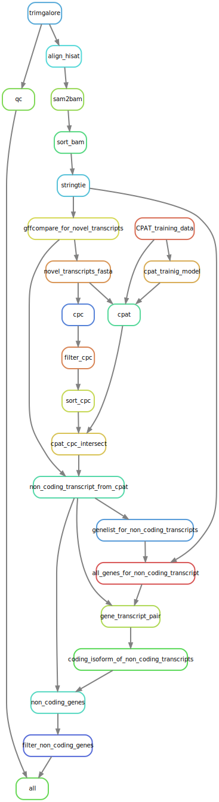

# lncRNA-analysis
A Snakemake-based pipeline to annotate lncRNA using existing annotation. 

## Description
This pipeline uses various bioinformatics tools to annotate lncRNA. It requires reference genome(s) (optional HISAT index), sequencing reads, and refrence annotation(s).

The pipeline works with following steps:
* uses HISAT2 to align all reads to the transcriptome, 
* creates new gene list with all known and novel genes.
* separates the novel genes 
* uses CPAT and CPC to annotate novel genes with coding potential
* extracts non-coding genes
* identifies and removes transcripts with coding isoforms and less than 200 bp long genes

## Pipeline
A simple overview of pipeline is as below:

## Authors
- Wilfried Haerty (Earlham Institute)
- Anil S. Thanki (Earlham Institute)

