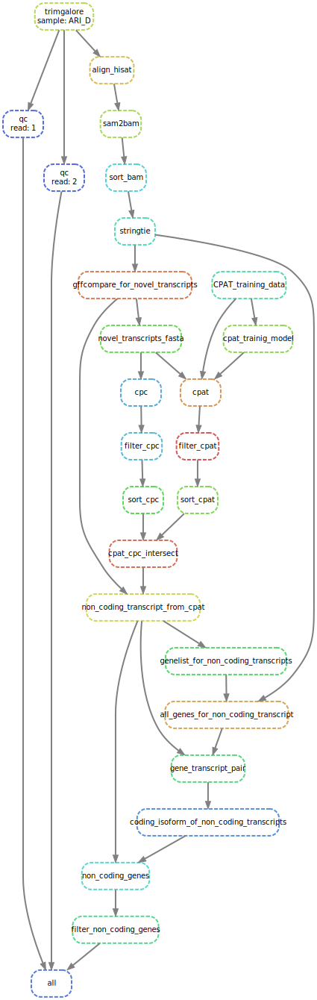
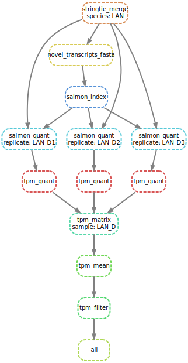

# lncRNA-analysis
A Snakemake-based pipeline to annotate novel lncRNA using existing annotation. 

## Description
This pipeline uses various bioinformatics tools to annotate lncRNA. It requires reference genome(s) (optional HISAT index), sequencing reads, and reference annotation(s).

The workflow is mainly divided into two parts:

### Part 1 (Snakefile):
The first part of pipeline works with the following steps:
* uses HISAT2 to align all reads to the transcriptome, 
* creates a new gene list with all known and novel genes.
* separates the novel genes 
* uses CPAT and CPC to annotate novel genes with coding potential
* extracts non-coding genes
* identifies and removes transcripts with coding isoforms and less than 200 bp long genes

### Part 2 (Snakefile_quantification):
The second part of pipeline works with the following steps:
* uses StringTie to merge lncRNAs from different sample 
* creates transcriptome using GFFread
* creates Salmon index for transcriptome 
* quantify lncRNAs of each replicate of tissue/sample using salmon
* creates a TPM matrix for each sample and replicates
* filter lncRNAs with low expression value

## Pipeline
A simple overview of pipeline is shown below:

Part 1 (Snakefile)          |  Part 2 (Snakefile_quantification)
:-------------------------:|:-------------------------:
 | 

## Creating Conda environment
This pipeline uses conda environments. Snakemake will create conda environments during the first run of the pipeline. However, if running this pipeline on High-Performance Computing (HPC) it may not have an active internet connection. In that case, conda environment can be created using `snakemake -s env_snakefile --useconda` command from the node with an internet connection. And then the pipeline will be able to utilise existing environments.

## Authors
- [Anil S. Thanki](https://www.earlham.ac.uk/anil-thanki) ([Earlham Institute](https://www.earlham.ac.uk/))
- [Wilfried Haerty](https://www.earlham.ac.uk/wilfried-haerty) ([Earlham Institute](https://www.earlham.ac.uk/))

