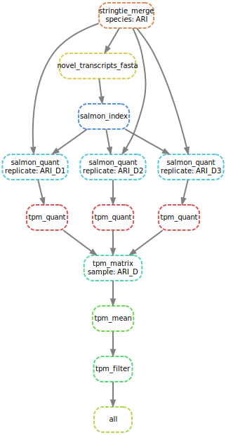

# lncRNA-analysis
A Snakemake-based pipeline to annotate lncRNA using existing annotation. 

## Description
This pipeline uses various bioinformatics tools to annotate lncRNA. It requires reference genome(s) (optional HISAT index), sequencing reads, and refrence annotation(s).

The workflow is mainly divided into two parts:

### Part 1 (Snakefile):
The first part of pipeline works with following steps:
* uses HISAT2 to align all reads to the transcriptome, 
* creates new gene list with all known and novel genes.
* separates the novel genes 
* uses CPAT and CPC to annotate novel genes with coding potential
* extracts non-coding genes
* identifies and removes transcripts with coding isoforms and less than 200 bp long genes

### Part 2 (Snakefile_quantification):
The second part of pipeline works with following steps:
* uses StringTie to merge lncRNAs from diffrent sample 
* creates transcriptome using GFFread
* creates Salmon index for transcriptome 
* quantify lncRNAs of each replicates of tissue/sample using salmon
* creates TPM matrix for each sample and replicates
* filter lncRNAs withh low expression value

## Pipeline
A simple overview of pipeline is shown below:

Part 1 (Snakefile)          |  Part 2 (Snakefile_quantification)
:-------------------------:|:-------------------------:
 | 

## Creating Conda environment
This pipeline uses conda environments. Snakemake will create conda environment during the first run of the pipeline. However, if running this pipeline on High Performance Computing (HPC) it may not have active internet connection. In that case, conda environment can be created using `snakemake -s env_snakefile --useconda` command from the node with internet connection. And then pipeline will be able to utilise existing environments.

## Authors
- Wilfried Haerty (Earlham Institute)
- Anil S. Thanki (Earlham Institute)

